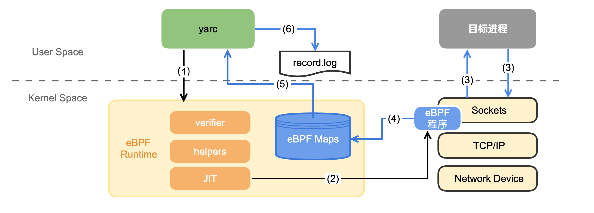

English | [中文](./README_zh.md)


# Yet Another Recorder(yarc)
Yarc is a traffic recording tool based on ebpf. It records real online traffic and uses the [traffic playback tool](https://github.com/didi/sharingan) for testing.
Yarc attaches the program used to hook the socket system function to the kernel system function through bpf, and transfers the recorded data to the user space with the help of BPF_MAP to achieve recording.
[More detail](https://mp.weixin.qq.com/s/6vD0cckviqLQidFb6Yo71Q)



## Requirements

* Linux (4.18.0-193.el8.x86_64)
* Go 1.18+
* Clang/LLVM 10+

## License
`yarc` is released under the Apache License. See the `LICENSE` file for more details.

## Getting Started
Use Makefile to build the project
```bash
make
```
Start traffic recording and pass in the process ID that needs to record traffic.
```bash
./yarc -p $PID
```
Request the target process to be recorded, and the recorded traffic will be stored in ./log/record.log
```bash
ls ./log/record.log
```

## Getting Help
Contact me to add a wechat group.


