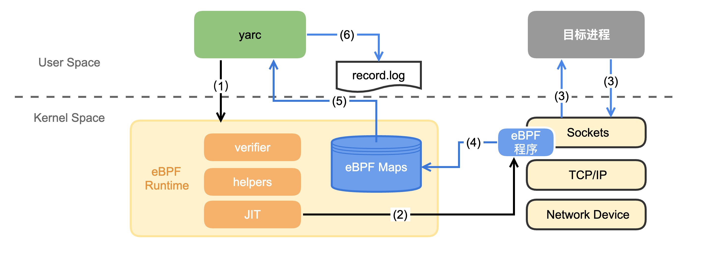

[English](./README.md) | 中文


# Yet Another Recorder(yarc)
Yarc 是一款基于ebpf的流量录制工具。录制线上的流量并且结合[流量回放工具](https://github.com/didi/sharingan)来进行测试。
Yarc 通过bpf将hook函数加载到内核中，并通过BPF_MAP来进行数据交换传输。
[更多详情](https://mp.weixin.qq.com/s/6vD0cckviqLQidFb6Yo71Q)



## Requirements

* Linux (4.18.0-193.el8.x86_64)
* Go 1.18+
* Clang/LLVM 10+

## License
Apache-2.0 license

## Getting Started
通过Makefile来编译构建
```bash
make
```
将需要录制的进程的进程id传入，来开启流量录制
```bash
./yarc -p $PID
```
当有请求经过进程后，流量会被录制下来，并存储到/log/record.log中
```bash
ls ./log/record.log
```

## Getting Help
由于微信群人数过多，联系下边微信拉进微信群

